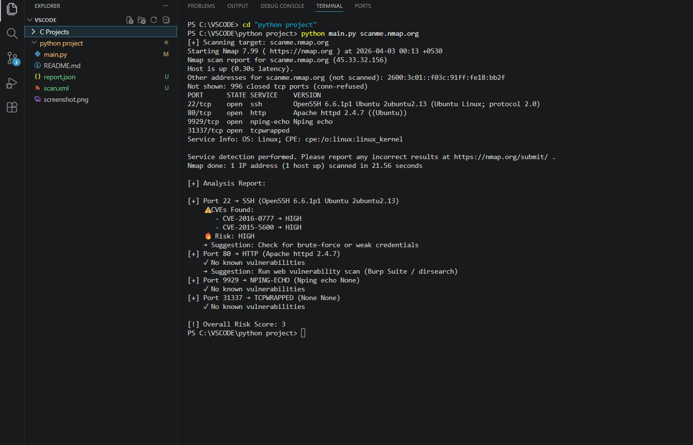

# 🔍 Smart Network Recon Tool

A Python-based network reconnaissance tool that automates scanning using Nmap and provides structured security analysis with service/version detection and basic CVE-based vulnerability mapping.

---

## 🚀 Overview

This project automates the process of network scanning and transforms raw Nmap output into meaningful security insights.

Instead of just listing open ports, it:

* Identifies running services and versions
* Highlights potential security risks
* Maps known vulnerabilities (CVEs)
* Generates a simple risk-based analysis

---

## 🎯 Why This Project?

Most beginners can run Nmap but struggle to interpret the results.

This tool bridges that gap by converting raw scan data into actionable insights using service detection, version analysis, and vulnerability mapping.

---

## ⚙️ Features

* Automated Nmap scanning
* Service and version detection
* XML parsing for structured data extraction
* Basic CVE mapping (local database)
* Risk scoring system
* Clean and readable output

---

## 🛠️ Tech Stack

* Python
* Nmap
* XML Parsing

---

## 🧠 How It Works

1. User inputs a target (IP or domain)
2. Tool runs Nmap scan (`-sT`, `-sV`)
3. Output is saved as XML
4. XML is parsed to extract open ports and services
5. Service versions are matched with known CVEs
6. Risk-based analysis is displayed

---

## ▶️ Usage

### Run the tool:

```bash
python main.py
```

### Enter target when prompted:

```
scanme.nmap.org
```

---

## 📸 Output Preview



---

## 📌 Example Output

```
[+] Port 22 → ssh (OpenSSH 6.6.1)
    ⚠️ Known Vulnerabilities:
       - CVE-2016-0777
       - CVE-2015-5600

[+] Port 80 → http (Apache 2.4.6)
    ⚠️ Known Vulnerabilities:
       - CVE-2017-3169

[!] Overall Risk Score: 6
```

---

## 🔍 CVE Mapping

The tool uses a basic local database to map service versions to known vulnerabilities (CVE).

This demonstrates how real-world vulnerability scanners correlate software versions with publicly known security issues.

---

## 📚 Learning Outcomes

* Understood network reconnaissance workflow
* Learned automation using Python
* Gained practical exposure to vulnerability analysis
* Improved understanding of service-version security risks

---

## ⚠️ Limitations

* Uses a manual CVE database (limited coverage)
* No real-time vulnerability lookup
* Not a full vulnerability scanner

---

## 🔮 Future Improvements

* Integration with real-time CVE APIs
* Severity classification (Low / Medium / High)
* Export reports (JSON / HTML)
* GUI-based interface

---

## ⚠️ Disclaimer

This tool is for educational purposes only.
Do not use it on systems without proper authorization.

---

## 👨‍💻 Author

**Sraban Kumar Singh**
B.Tech CSE Student | Cybersecurity Enthusiast

GitHub: https://github.com/ig-rajput
